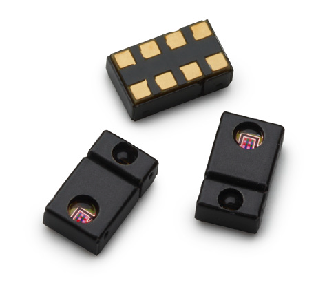
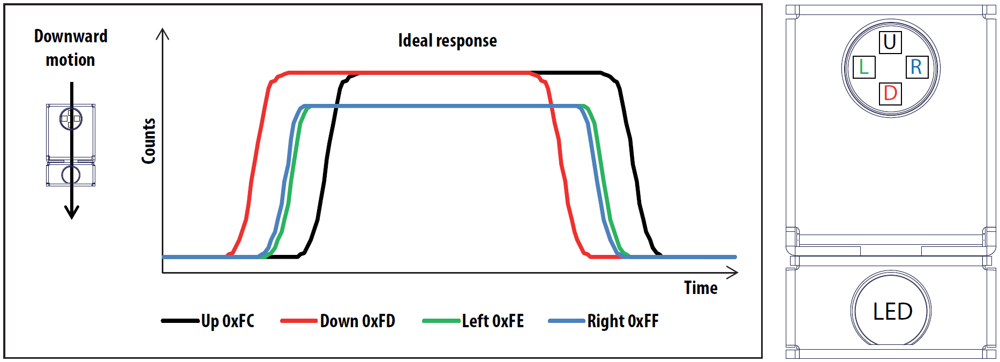
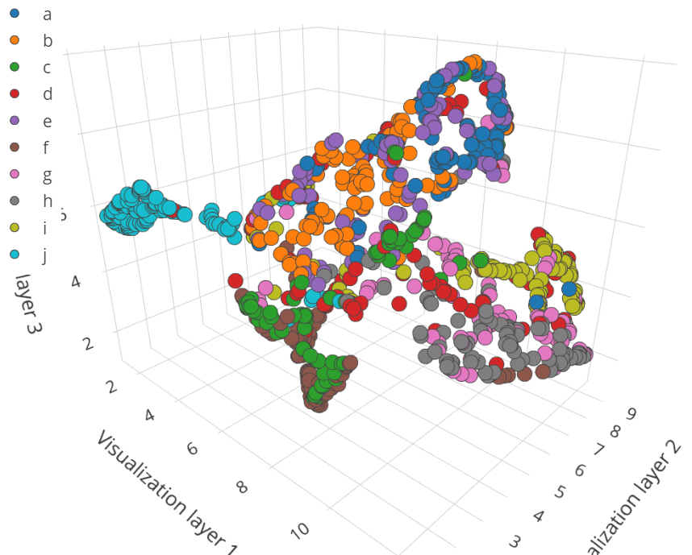
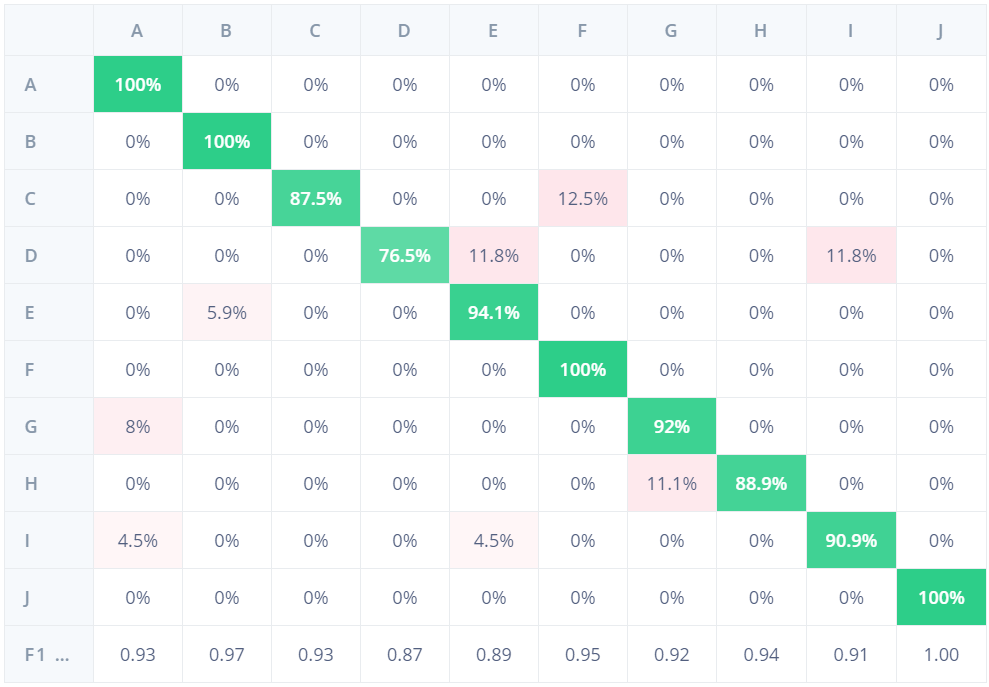
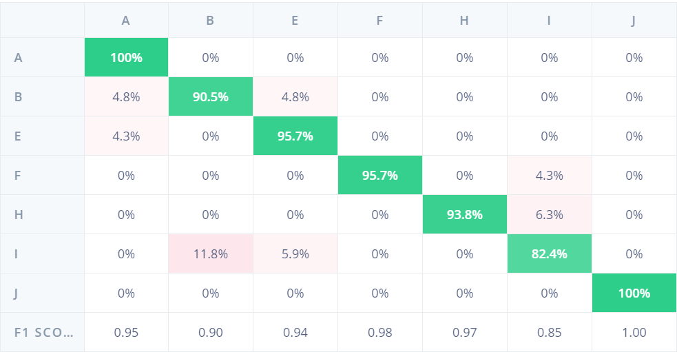
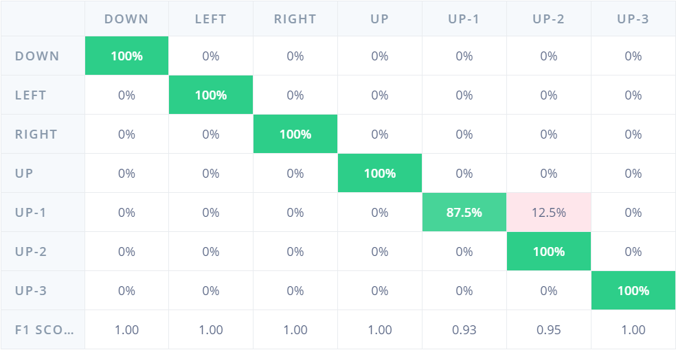
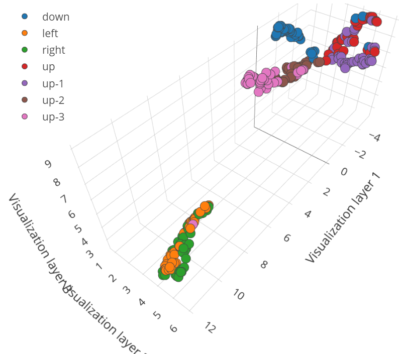
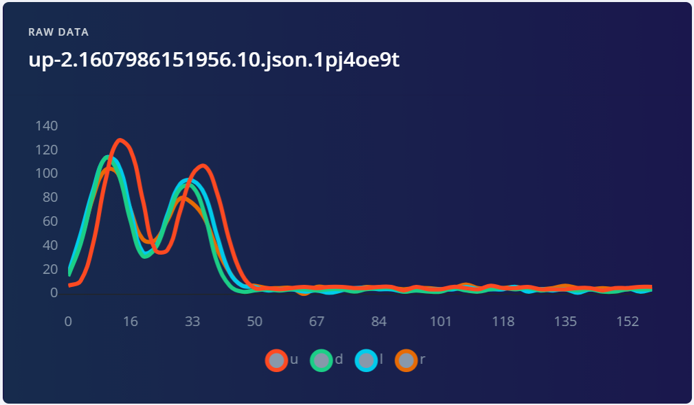
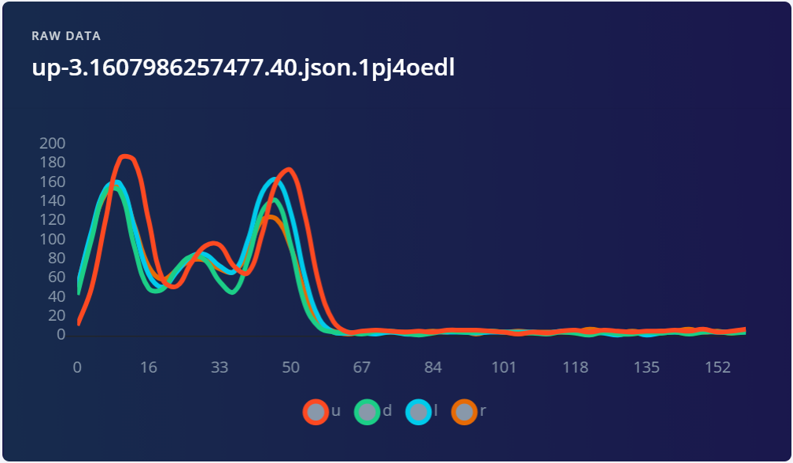

# Situational Awareness and Gesture Control for Smart Lights

Project for ECE M202A Embedded Systems.

## Abstract

Smart lights often feature smartphone or voice control, scheduling, and color and brightness selection, but lack any situational awareness capabilities that react to the environment. Additionally, users cannot change these settings without a smartphone or smart speaker, which may not be practical in all situations. The smart light switch proposed here aims to address these issues by increasing automation through situational awareness features such as adaptive brightness and motion detection to automatically set lights according to environmental conditions and personal preferences. Additionally, manual control will be possible without other smart devices through advanced gesture control powered by embedded neural networks.

## Project Details

The smart light switch is based on the Arduino Nano 33 BLE Sense and uses the integrated APDS-9960 sensor for gesture control and brightness detection, and the integrated BLE transceiver in the nRF52840 MCU for remote control. Externally, a HC-SR501 PIR motion sensor is used for motion detection and an ESP8266 is used for controlling the WiFi light bulbs.

The focus of this project is the advanced gesture control feature. Existing gesture control systems either use cameras and complex neural networks (which require high computational power), or extremely simple hardware and algorithms which can only differentiate between a few different gestures. The Arduino Nano 33 BLE Sense provides a simple solution with the APDS-9960 sensor and can only differentiate between four directions with existing libraries. Using Edge Impulse, we hope to expand the capabilities of the APDS-9960 gesture control system so it can detect more advanced hand gestures to allow for more complex commands in the computationally constrained environment.

## Project Timeline

Weeks 1-2: Class begins, order Arduino Nano 33 BLE Sense, explore basic functionality.

Weeks 3-4: Project requirements and past projects presented in class, finalize teams and project plan. Explore basic motion, brightness, and gesture sensing.

Weeks 5-6: Add WiFi support with an ESP8266. Integrate WiFi light control with basic motion, brightness, and gesture sensing.

Weeks 7-8: Project video on preliminary design/results. Add personal profiles and smartphone detection. Begin working on advanced gesture control.

Weeks 9-10: Deep dive into advanced gesture control with neural networks.

Week 11: Final project video.

## Technical Approach

### Hardware List

Arduino Nano 33 BLE Sense
* nRF52840 MCU with integrated Bluetooth
* APDS-9960 RGB and gesture sensor

HC-SR501 PIR motion sensor

ESP8266 WiFi MCU

### Libraries

The following additional libraries are used:

* Available from the Arduino Library manager
  * [WiFiEspAT](https://github.com/jandrassy/WiFiEspAT) v1.3.1
  * [ArduinoBLE](https://www.arduino.cc/en/Reference/ArduinoBLE) v1.1.3
* External
  * [ArduinoLifx](https://github.com/tigoe/ArduinoLifx) commit 823c6d3
* Included in this repo
  * Arduino_APDS9960_mod (a modified version of [Arduino_APDS9960](https://github.com/arduino-libraries/Arduino_APDS9960))
  * switch_inference, created with [Edge Impulse](https://www.edgeimpulse.com/)

Note that the latest WiFiEspAT library requires the ESP8266 to have firmware version 1.7 or higher. Connecting directly to the device with a USB to serial converter showed that ours came with version 1.5 (seen from the AT+GMR command) and had to be updated. Instructions for updating can be found in the [ESP32 Flash Download Tool](https://www.espressif.com/en/products/socs/esp32/resources), with additional information from other guides (such as [this one](http://iot-bits.com/esp32/esp32-flash-download-tool-tutorial/) from IoTBits). Note that the exact process will differ depending on the ESP8266's flash size, SPI speed, and crystal frequency.

### Gesture Detection

This project uses the APDS-9960 sensor, which detects gestures through four directional photodiodes. The sensor captures data four bytes at a time (representing amplitude of the up, down, left, and right directional photodiodes) and saves it in a FIFO that can hold up to 32 readings (128 bytes total); 4-byte readings are sampled at approximately 295 Hz (measured rate). Gesture detection is done by reading this data and comparing the differences in amplitude and phase between the four photodiodes.


Figure 1: APDS-9960 Sensor


Figure 2: APDS-9960 Directional Orientation

#### Dataset Collection

Data is collected from the APDS-9960 sensor by adding the custom function `bool updateReadings(uint8_t *buf, uint16_t buf_size)` to the Arduino_APDS9960 library (or Arduino_APDS9960_mod here) that fills a given buffer with the FIFO data and returns true if a threshold is met. For example, given a 128-byte buffer, the function will fill it with 32, 4-byte readings from the sensor over a 108 ms period (calculated from the sampling frequency of 295 Hz). Alternatively, if given a 192-byte buffer, the function will fill it with 48, 4-byte readings over a 162 ms period. For the purpose of training, these buffers are printed over serial, captured by a Python script, and formatted into .json files that Edge Impulse can digest.

#### Model

We use a basic convolutional neural network (CNN) as the model architecture. A single 1D convolution layer with 16 filters and a kernel size of 64 helps identify spatial information, then the dense layers help find correlations and classify the signal.

```
Model: "sequential"
_________________________________________________________________
Layer (type)                 Output Shape              Param #   
=================================================================
reshape (Reshape)            (None, 48, 4)             0         
_________________________________________________________________
conv1d (Conv1D)              (None, 48, 16)            4112      
_________________________________________________________________
max_pooling1d (MaxPooling1D) (None, 24, 16)            0         
_________________________________________________________________
dropout (Dropout)            (None, 24, 16)            0         
_________________________________________________________________
flatten (Flatten)            (None, 384)               0         
_________________________________________________________________
dense (Dense)                (None, 384)               147840    
_________________________________________________________________
dense_1 (Dense)              (None, 192)               73920     
_________________________________________________________________
y_pred (Dense)               (None, 10)                1930      
=================================================================
Total params: 227,802
Trainable params: 227,802
Non-trainable params: 0
_________________________________________________________________
```

## Experimental Results for Advanced Gesture Control

This section contains two separate neural network gesture control projects.

The first project aims to understand the general limitations of gesture recognition using this system by attempting to classify the first 10 characters (A-J) of the American Manual Alphabet (AMA, or American Sign Language alphabet) when waved in front of the sensor. Given the complex nature and similarity of some of these gestures, the data gathered from the directional photodiodes is not expected to always be separable. Findings from these tests will help us better understand of the limitations of the sensor.

The second project is a simple implementation of the above model architecture, and only identifies more basic, easily separable gestures which will command the smart switch device. Gestures include, up, down, left, right, and three other upward gestures (one finger, two fingers, and three fingers) to change the lighting profile.

The following sections will focus on the AMA project, with a quick overview of the smart switch implementation at the end.

### Dataset and Features

The training dataset contains 100 samples for each gesture, and the test dataset contains 20. Samples were collected in four different sittings (50 samples of each class were collected in each of two of the sittings, and 10 samples of each class each were collected in each of the other two), more on why this is important later. Each sample consists of 48 readings (with each reading containing one byte for each direction, so four bytes total) saved in a 192-byte buffer over a period of 162 ms.

The image below shows the input features projected in a 3-dimensional space to help visually understand the separability of the input data. When all gestures are included it is clear there is a lot of overlap and that the model will likely have some issues.


Figure 3: ASL Shuffled Features

### Accuracy

By shuffling all the data and letting Edge Impulse automatically split training and testing data, training accuracy comes to 93.3% (with a loss of 0.20) and test accuracy comes to 88.9%. By removing the three gestures that cause the most problems (D, C and G), the model's training accuracy increases slightly to 94.2% (with a loss of 0.50) and the test accuracy increases to 97.4%.


Figure 4: ASL 10-Class Confusion Matrix (Shuffled Data, Training)


Figure 5: ASL 7-Class Confusion Matrix (Shuffled Data, Training)

If the data is separated by sitting (50x2 training samples and 10x2 test samples) then the training accuracy is much worse. Training accuracy on all the labels comes to 94.0% (with a loss of 0.35), but test accuracy is only 71.0%. By removing D, C and G the training accuracy increases to 100% (with a loss of 0.00) and test accuracy increases to 88.6%.

The second method, where the train and test data is split by sitting, shows clear signs of overfitting. The trained model is not general enough to handle slight variations in the gestures. Overfitting is usually caused by a model that is too complex or a lack of data, but in this case it, is likely also due to the data itself being too complex. If the sensor cannot detect differences between two gestures, the model will start extracting other features it is supposed to ignore (such as gesture speed or distance). The lack of sufficient training data combined with gestures that are too similar likely result in the poor performance. Testing accuracy skyrockets after removing the most problematic labels, supporting the latter part of this theory.

Finally, inference time is only 75 ms on the Arduino Nano 33 BLE Sense and it uses 257.4K ROM and up to 4.8K RAM.

### Smart Switch Implementation

Gesture control for the smart switch uses the same model architecture but is trained from scratch using different data. As mentioned earlier, the switch can identify seven gestures: up, down, left, right, up-1, up-2, and up-3. 50 samples from each class were captured (350 samples total) and uploaded to Edge Impulse to split between training and test datasets. Each sample consists of 32 readings (with each reading containing one byte for each direction, so four bytes total) saved in a 128-byte buffer over a period of 102 ms.

The resulting model has a training accuracy of 98.2% (with a loss of 0.10) and test accuracy of 97.1%. Inference time is only 55 ms (20 ms less than the ASL model) and it uses 209.4K ROM and up to 4.3K RAM.


Figure 6: Smart Switch Confusion Matrix (Training)

This model achieves much higher accuracy with fewer samples than the ASL gesture model. The main reason for this is because the gestures are more simple and easily separable, as seen in the features image below. Additionally, examples of the up-2 and up-3 gesture data shows how significant the difference is between the two.


Figure 7: Switch Features


Figure 8: Up-2 Gesture Data


Figure 9: Up-3 Gesture Data

## Conclusion and Next Steps

Results from the gesture detection model show that it is capable of properly identifying gestures if they are different enough. More work needs to be done to ensure the model can generalize better and not overfit. Low level photodiode parameters such as gain, drive strength, and pulse settings and their effects should also be investigated to potentially improve accuracy. Additionally, tests on optimal gesture distance should be conducted after modifying photodiode parameters, to see if it is possible to capture more of the hand if further away.

The gesture detection architecture worked well with the smart switch and achieves high accuracy with a low number of training samples. In addition to responding to gestures, the smart switch also successfully incorporates multiple sensors to better respond to the environment. Future work could include better tuning the environment parameters and timeouts, and even learning and adapting the parameters according to user behavior during use.
